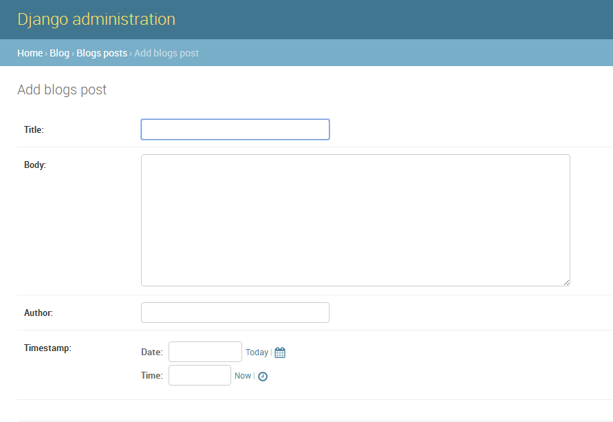

# myBlog
一个前端React后端Django的建议blog模版，还在完善中

前端：

命令行中cd到 `blog/static/js` 下 运行 `npm install` 安装依赖

（如果没有webpack）请`npm install -g webpack` 全局安装webpack 

再 `webpack --watch` 打包编译前端代码，再开启django的服务器

后端：

安装一些必须的模块之后，

`python manage.py makemigrations` 之后 `python manage.py migrate` 更新下数据库

再`python manage.py runserver` 开启服务器。

开启服务器之后，

- [x] `http://127.0.0.1:8000/index`  是前后分离版，数据读取还有些问题。
- [ ] `http://127.0.0.1:8000/index2` 是前后未分离版，可以进入后台修改博客在前台展示。

添加博客的界面是这样的：
